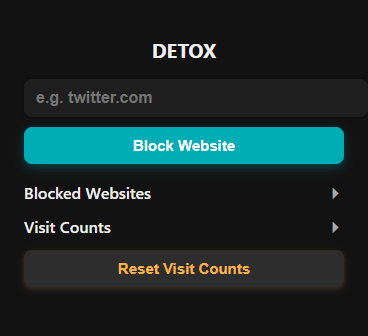

# Detox — Chrome Extension

Detox is a Chrome extension that helps you stay focused by blocking distracting websites.

## Features

- Add any website to block (like youtube.com, instagram.com)
- Tracks how many times you've tried visiting blocked sites
- Option to reset visit counters

## NOTE

**ALWAYS ENTER DOMAINS IN THE FORM `youtube.com` OR `www.youtube.com`.  
DO NOT INCLUDE `https://`, `http://`, OR ANY EXTRA PATHS.  
BLOCKING WILL NOT WORK IF THE FORMAT IS INCORRECT.**

- ## How to Add the Extension

1. Open Chrome and go to `chrome://extensions/`
2. Turn on **Developer mode** (top right corner)
3. Click **Load unpacked**
4. Select the folder where Detox files are saved
5. The Detox icon will appear in your toolbar
